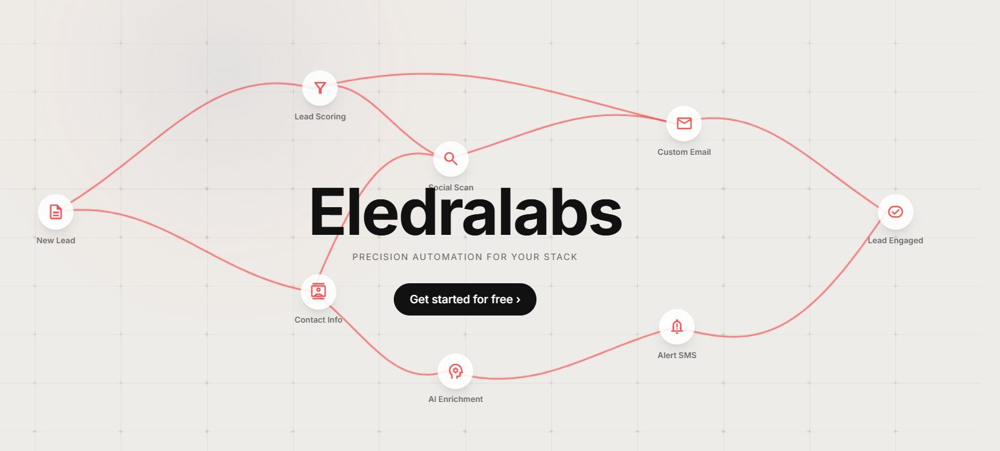
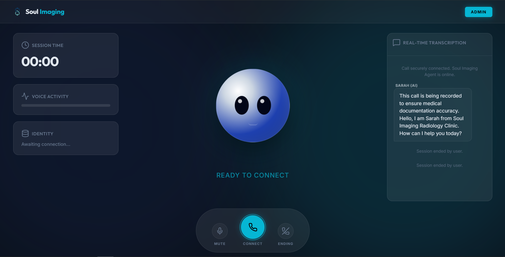
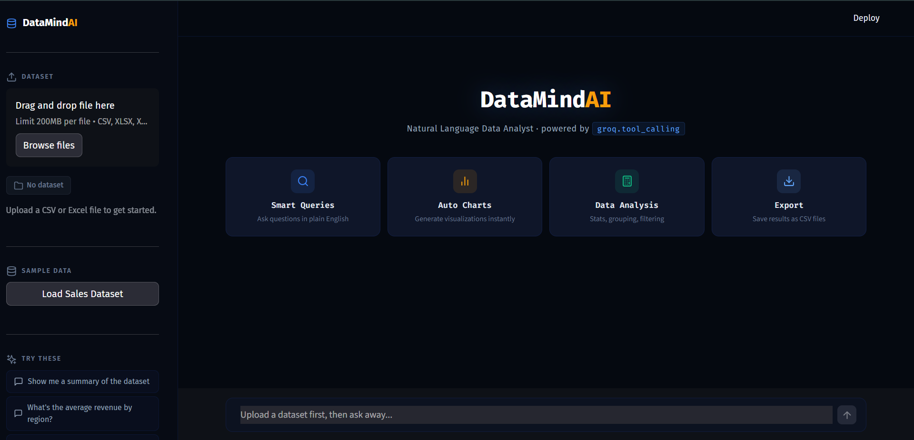
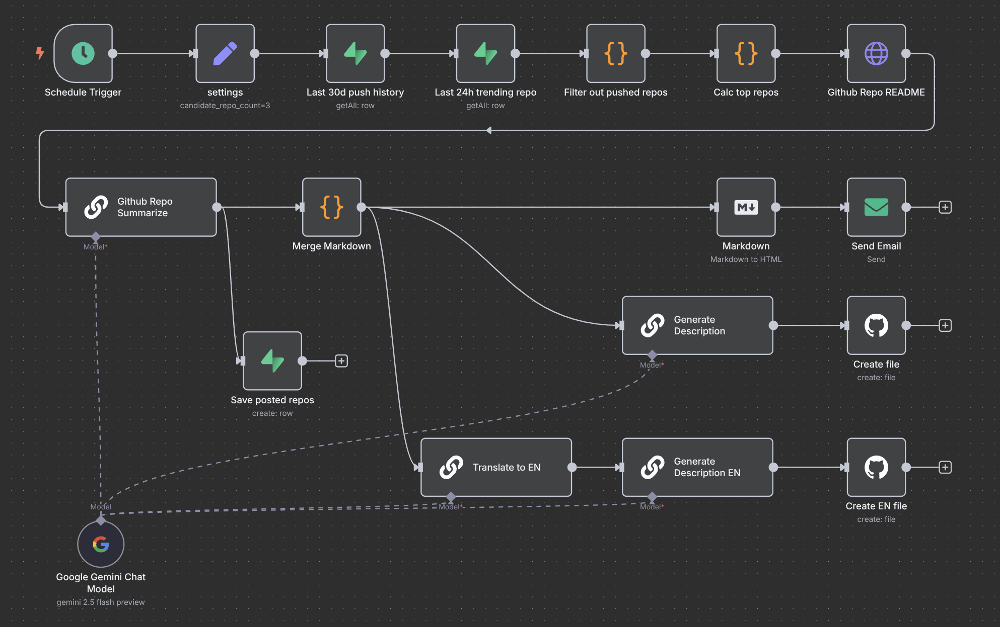

# Eledralabs — High-Performance Automation & Web Architecture

Eledralabs is an architectural automation and bespoke engineering landing platform designed from the ground up to showcase state-of-the-art Web and AI systems. Built with ultra-high contrast dark aesthetics, responsive layouts, modular client-side loading, and micro-animations.

---

## 📸 Platform Showcases

Our interactive solutions bento grid utilizes floating digital screens, perfectly proportioned and responsive, representing key operational categories:

### 01 / Custom Website Development
High-performance frameworks designed with infinite scale, robust search visibility, and zero operational drag.


### 02 / AI Voice Agents
Deploy conversation voice nodes capable of handling telephony routing, automatic call triage, and client booking.


### 03 / Custom LLM Chatbots
Context-aware custom language models trained on proprietary files, offering real-time zero-latency support.


### 04 / IT Service Automations
Automate routine ticketing diagnostic workflows, password recoveries, and continuous integration pipeline routes.


---

## 🛠️ Architecture & Core Components

Rather than relying on heavy compilation pipelines, Eledralabs loads isolated, reusable HTML modules dynamically on the client side:

1. **Modular Engine (`index.html`)**: Features an asynchronous client-side parser that loads modular HTML partitions with real-time hot-reloading cache control.
2. **Shrinking Navigation Header (`components/header.html`)**: Implements scroll listeners that shrink the nav height seamlessly from `64px` to `52px` and transition it to a blur-enhanced `#000000` glass solid block to preserve readability over background text.
3. **Featured Core (`components/hero.html`)**: Holds 6 premium custom-designed vector SVGs complete with distinct dynamic glow transitions on cursor hover:
   * **Agent Orchestration** &rarr; Emerald Green 🟢
   * **Docker Sandbox** &rarr; Vibrant Cyan 🔵
   * **Reinforcement Learning** &rarr; Electric Purple 🟣
   * **Verification Layer** &rarr; Neon Red 🔴
   * **Full Observability** &rarr; Solar Yellow 🟡
   * **Distributed Compute** &rarr; Hot Pink 💗
4. **Solutions Showcase Grid (`components/services.html` & `components/solutions.html`)**: Displays responsive screenshot panels using widescreen aspect ratios (`object-fit: contain`) wrapped in glass containers with floating scale animations.

---

## 🚀 Getting Started

Ensure you have **Node.js** installed on your workstation.

### 1. Launch the Server
To preview the modular fetch requests without CORS blocking, run a static HTTP server in the root directory:
```bash
# Start a hot HTTP server
npx -y http-server -p 8000 -c-1
```
Open your browser and navigate to **`http://localhost:8000`** to test your changes.

### 2. Customizing Platform Images
To update any screenshot panel instantly without editing lines of code:
* Place your image files in the `backgrounds/` folder using the exact filenames:
  - `solutions-1.png`
  - `solutions-2.png`
  - `solutions-3.png`
  - `solutions-4.png`
* The website will automatically reload and wrap your custom assets inside the premium radial glass mockup layers.
